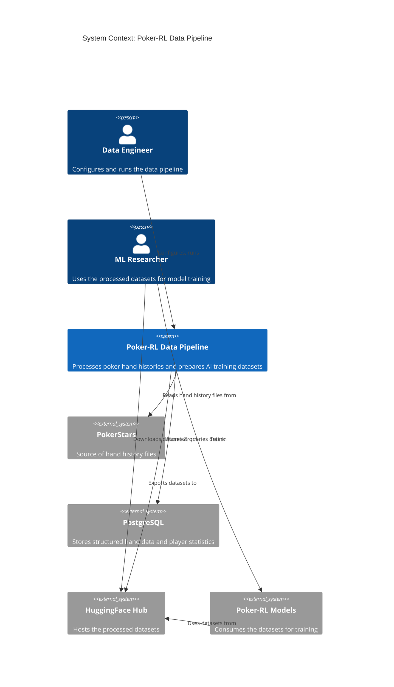
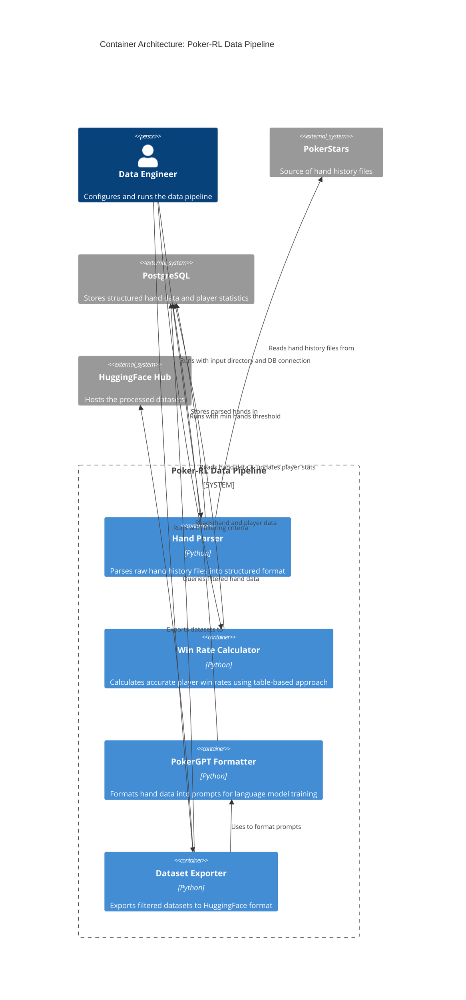
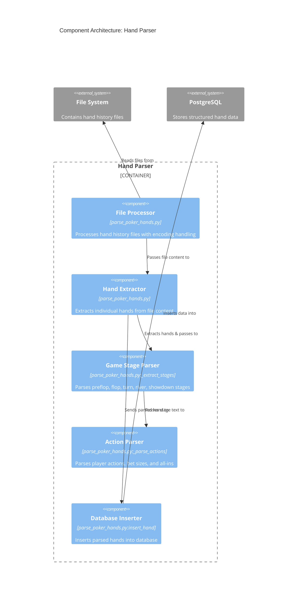
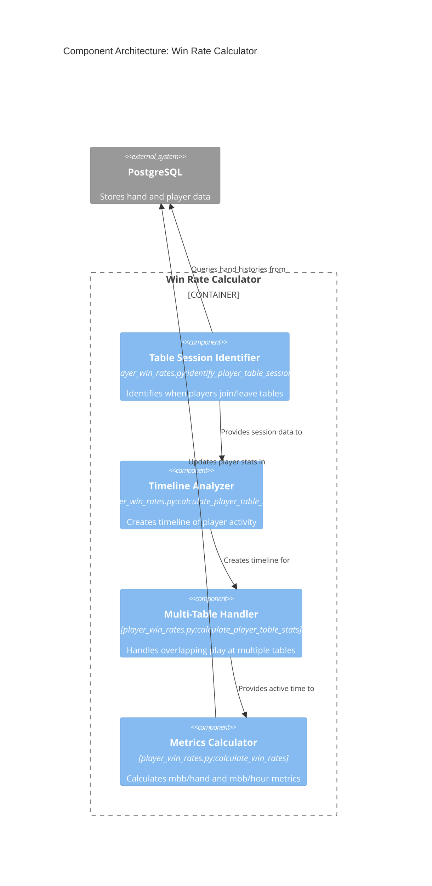
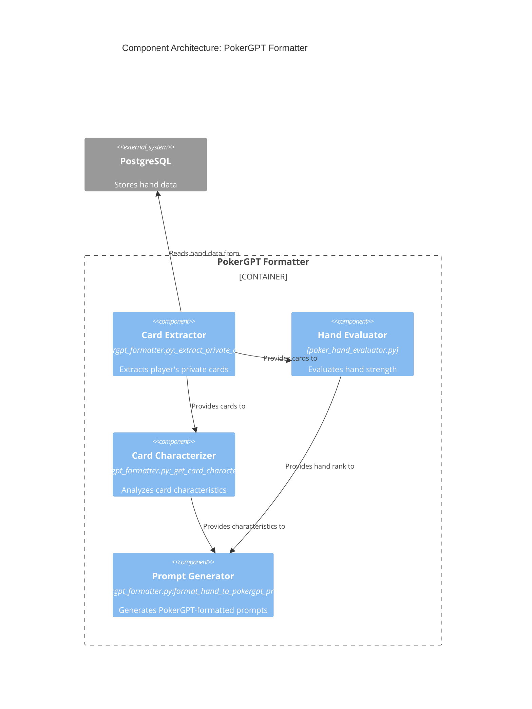
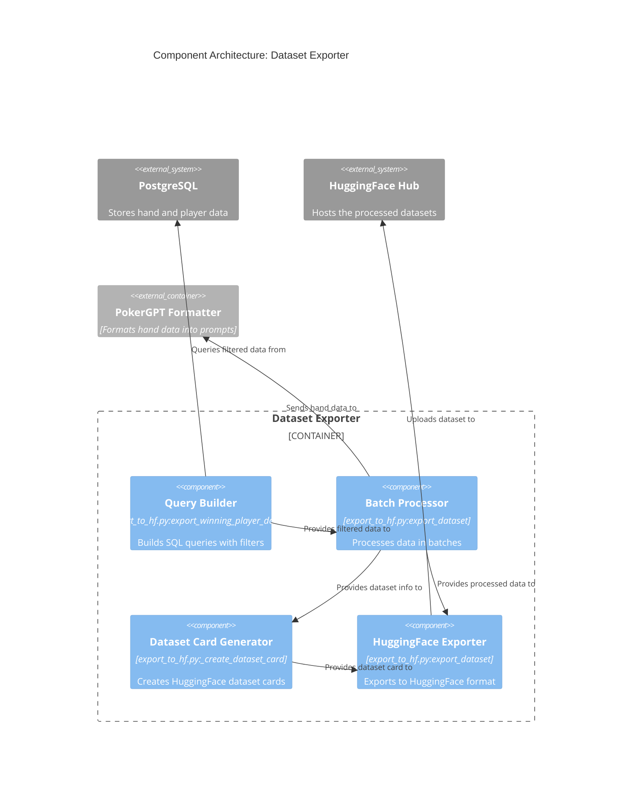
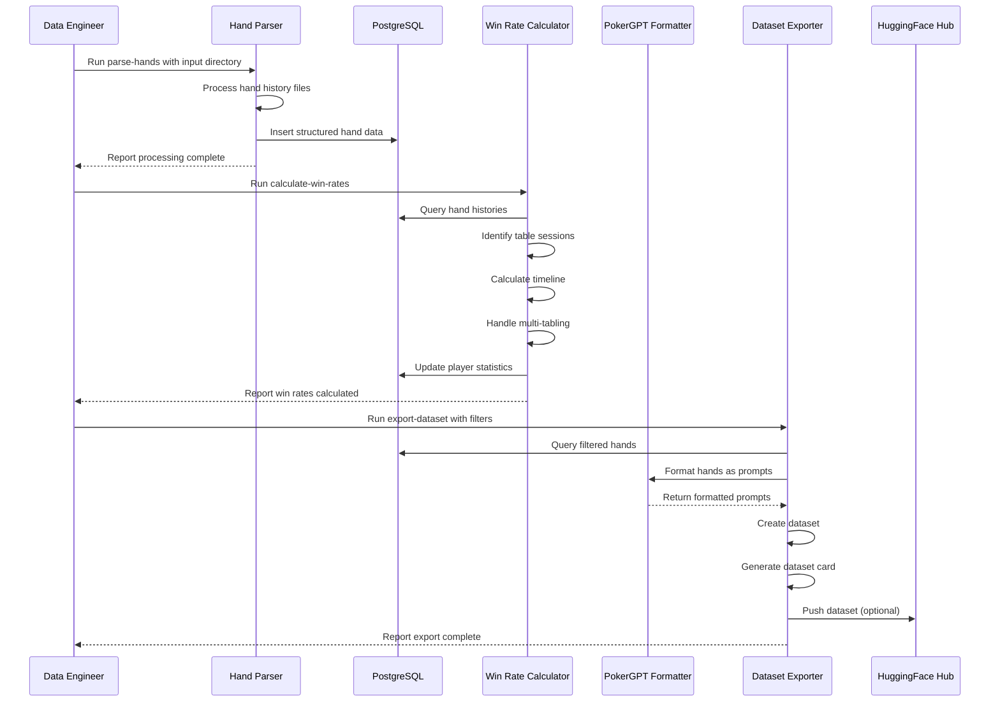

# Poker-RL Data Pipeline Architecture

## Overview

The Poker-RL Data Pipeline is a comprehensive data processing system designed to transform raw poker hand histories into high-quality training datasets for poker AI models. The system focuses on accurately identifying skilled players through sophisticated win rate calculations, and preparing structured data in formats optimized for reinforcement learning and language model training.

## System Context

The following diagram illustrates how the Poker-RL Data Pipeline interacts with external systems and users:

## Container Architecture

The pipeline consists of four primary containers, each handling specific aspects of the data processing workflow:

## Component Architecture

Each container consists of multiple components with specific responsibilities:

### Hand Parser Components

### Win Rate Calculator Components

### PokerGPT Formatter Components

### Dataset Exporter Components

## Process Flow

The following sequence diagram illustrates the high-level flow through the Poker-RL Data Pipeline:

## Component Details

### 1. Hand Parser (`parse_poker_hands.py`)

The Hand Parser is responsible for converting raw poker hand history text files into structured database records.

**Key Responsibilities:**
- Process hand history files with robust encoding handling
- Extract individual hands using regex pattern matching
- Parse game stages (preflop, flop, turn, river, showdown)
- Extract player actions, cards, and bet amounts
- Handle special cases like multi-board hands
- Store structured data in PostgreSQL

**Design Considerations:**
- Uses regex patterns for reliable text parsing
- Implements error handling for problematic hands
- Tracks diagnostic information for parser issues
- Batches database operations for efficiency

### 2. Win Rate Calculator (`player_win_rates.py`)

The Win Rate Calculator implements a sophisticated table-based approach to accurately measure player skill levels.

**Key Responsibilities:**
- Identify distinct table sessions for each player
- Detect when players join and leave specific tables
- Create a timeline of active play accounting for multi-tabling
- Calculate precise active playing time
- Compute win rates in mbb/hand and mbb/hour

**Design Considerations:**
- Uses timeline analysis to handle overlapping table sessions
- Accounts for breaks between sessions
- Normalizes win rates based on actual active time
- Maintains detailed table session data for analysis

### 3. PokerGPT Formatter (`pokergpt_formatter.py`)

The PokerGPT Formatter transforms structured hand data into prompts formatted for language model training.

**Key Responsibilities:**
- Extract player private cards from showdown hands
- Evaluate hand strength using the poker hand evaluator
- Analyze card characteristics (high cards, suited, connected)
- Generate prompts following the PokerGPT paper format
- Support action extraction for supervised training

**Design Considerations:**
- Follows the exact prompt structure from PokerGPT research
- Provides card and hand analysis
- Formats stage-specific information
- Presents appropriate action options

### 4. Dataset Exporter (`export_to_hf.py`)

The Dataset Exporter filters hand data by player skill and prepares datasets for HuggingFace.

**Key Responsibilities:**
- Build SQL queries with filtering criteria
- Process data in batches to handle large datasets
- Generate formatted prompts using the PokerGPT Formatter
- Create comprehensive dataset cards
- Export to HuggingFace Dataset format
- Push datasets to HuggingFace Hub

**Design Considerations:**
- Supports multiple filtering options (win rate, hands played)
- Creates specialized datasets (winning players, preflop decisions)
- Handles authentication with HuggingFace Hub
- Provides detailed dataset documentation

## Data Model

The system uses two primary database tables:

### `hand_histories` Table

Stores individual poker hands with structured data:
- `hand_id`: Unique identifier
- `raw_text`: Original hand history text
- `pokergpt_format`: JSON representation
- `game_type`: Type of poker game
- `blinds`: Array of small/big blind values
- `big_blind`: Big blind amount
- `player_count`: Number of players
- `winner`: Player who won the hand
- `bb_won`: Amount won in big blinds
- Game state flags (`has_preflop`, `has_flop`, etc.)
- `player_ids`: Array of player identifiers
- `table_name`: Name of the poker table
- Various position and timestamp information

### `players` Table

Stores player statistics with an emphasis on table-based metrics:
- `player_id`: Unique identifier
- `total_hands`: Total number of hands played
- `total_bb`: Total big blinds won/lost
- `mbb_per_hand`: Win rate in milli-big blinds per hand
- `mbb_per_hour`: Win rate in milli-big blinds per hour
- `hands_per_hour`: Average hands played per hour
- `active_hours`: Total time actively playing
- `tables`: Number of distinct tables played
- `table_sessions`: Number of distinct table sessions
- `table_data`: JSONB array of table session details
- Timestamp information

## Technical Implementation

The pipeline is implemented in Python with the following key dependencies:
- `psycopg2`: PostgreSQL database connectivity
- `pandas`: Data manipulation
- `datasets`: HuggingFace dataset creation
- `huggingface-hub`: HuggingFace Hub integration

Command-line interfaces are provided for each major component:
- `parse-hands`: Parse hand history files
- `calculate-win-rates`: Calculate player win rates
- `export-dataset`: Export filtered datasets
- `create-pokergpt-dataset`: Create specialized PokerGPT datasets

## Future Considerations

1. **Scalability Improvements**:
   - Implement parallel processing for hand parsing
   - Add support for incremental updates to the database
   - Optimize database queries for larger datasets

2. **Feature Enhancements**:
   - Support for additional poker variants
   - Enhanced player skill metrics beyond win rate
   - Strategic decision point identification

3. **Integration Options**:
   - Direct integration with poker AI training pipelines
   - Real-time processing capabilities
   - API for programmatic access to processed data